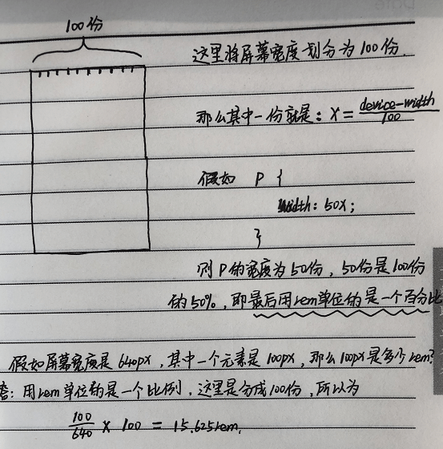
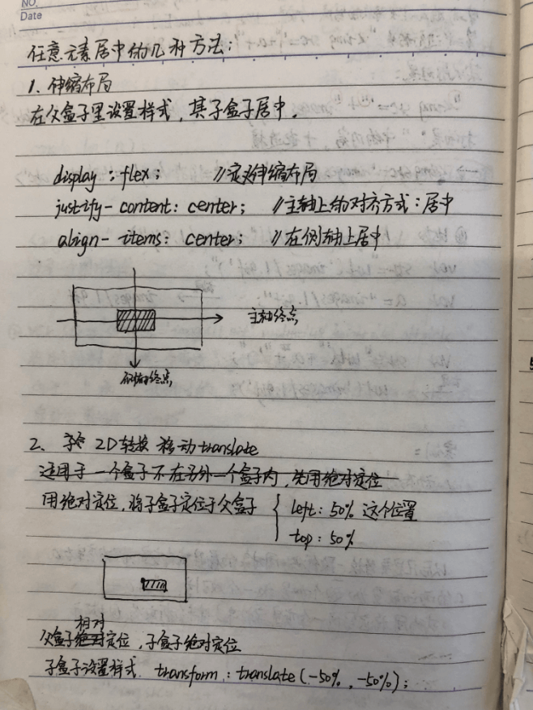
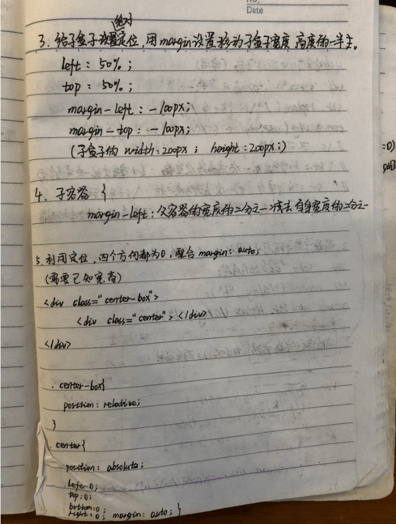
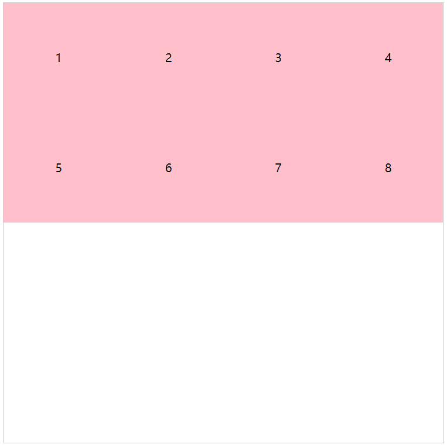
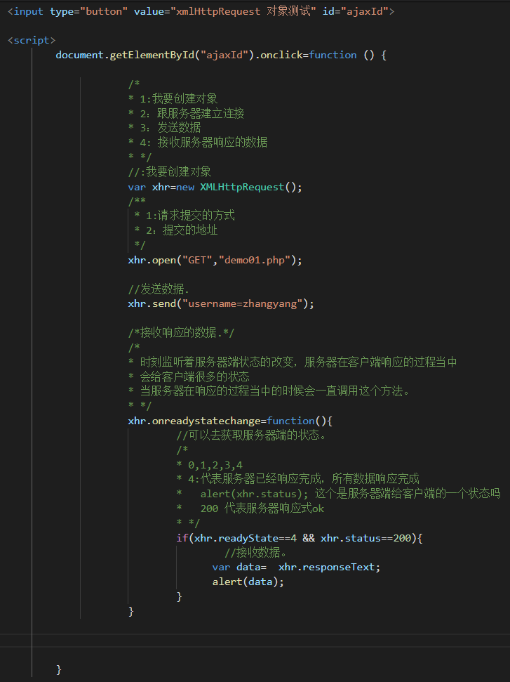
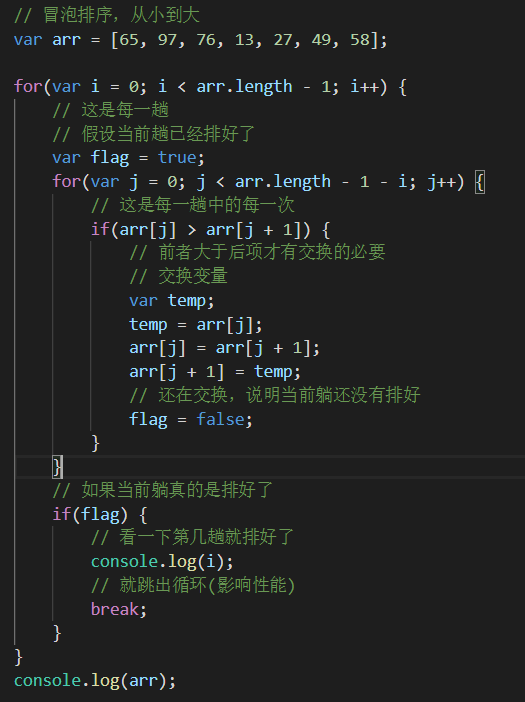
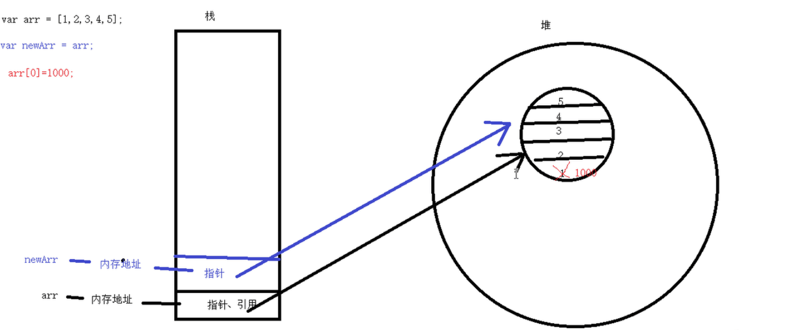

# HTML

## 1.你是如何理解 HTML 语义化的？

写HTML有这样一个发展过程:
  早期是由后台人员来进行页面开发的,他们大量使用table标签,table套用table.
  后来出现了美工,开始使用DIV+CSS布局,全部用div写,
  再后来出现了前端专门写前台,运用正确的标签来进行页面开发.

对于以上三种,第一种不是正确的写法,会造成后期难以维护,第二种有所改进,div来代替table,但是还是不够语义化.第三种运用正确的标签来做正确的事情才是正确的写法.

所以我觉得HTML语义化就是用正确的标签来做正确的事情.比如段落就用P标签,标题就用h标签,头部就用header标签,主要内容就用main标签,尾部就用footer标签等等.

延伸: 那么语义化有什么好处呢?
便于大家阅读,便于维护,能让页面结构更清晰,便于对浏览器、搜索引擎解析.即使没有css,也会以一种文档的格式存在,便于爬虫

----------------------------------------------------------------------------------------------------------------------

## 2.meta viewport 是做什么用的，怎么写？

1.举例缩放
2.引出视口
3.怎么解决

假如我想让一个PC页面，在移动端手机浏览器中打开，你会发现页面缩放了。
为什么会缩放呢？这是因为网页实际上是显示在视口里面，视口的实际大小是980PX，
而视口承载在浏览器里面（浏览器宽度320px-640px），
为了完整显示就会产生一个缩放效果。

解决的话，可以调整视口的宽度和浏览器一样宽

```<meta name="viewport" content="width=device-width, initial-scale=1, maximum-scale=1, minimum-scale=1">```
<br />
宽度等于设备宽度
初始化缩放比例为1
最大缩放比例为1
最小缩放比例为1

延伸：rem布局写页面的原理是什么？

rem的布局本质是等比缩放

```
// 实际文本元素所占用的空间
var documentElement = document.documentElement;
var clientWidth = documentElement.clientWidth;
clientWidth = clientWidth > 780 ? 780 : clientWidth;
// 如果屏幕是320px,此时HTML大小是3.2px，而浏览器最小字体是12px，所以换成平均10份（上面图片 最后结果比例 x 10 就对了）
documentElement.style.fontSize = clientWidth / 10 + 'px';
```
----------------------------------------------------------------------------------------------------------------------

## 3.你用过哪些 HTML 5 标签？
头部 header
主要内容 main
尾部 footer
区块 section

----------------------------------------------------------------------------------------------------------------------

## 4.H5 是什么？
H5反正不是HTML5,HTML5是HTML的一个标准，而H5更多是营销提出来的一个产品名称，是指移动端的 web 或者web app，
比如微信中易于分享传播.收集信息的页面。还有是嵌套在webview
中的页面，都是h5。

# css
## 1.两种盒模型分别说一下
盒模型就是盒子的一种计算方式
<br />
标准盒模型(box-sizing: content-box;)
content + padding + border + margin
原来的计算方式是：content + padding + border = 最终的宽高
<br />
<br />
还有一种盒模型是(box-sizing: border-box;)改变了盒子的计算方式
盒子的大小就是实际设置width、height，盒子的大小不会发生变化，更改设置的宽高，会改变content的大小。
现在的计算方式：content + padding + border = 设置的宽高，
<br />
区别在于他们计算方式不一样，第二种好处在于，如果重新更改css，不会影响相邻元素，第一种比较清晰，各有各的好处吧。

----------------------------------------------------------------------------------------------------------------------
## 2.如何垂直居中？
1.绝对定位(3种)
①算它的宽度高度各一半
②transform: translate(-50%, -50%);
③四个方向都为0. margin: auto;
2.flex布局，主轴测轴居中
3.margin: 0 auto; margin-top父减子高度一半（没有border会塌陷)



若不知道盒子具体宽高，有3种方式可以实现垂直水平居中。（2种绝对定位 + 伸缩布局）

------------------------------------------------------------------------------------------------------------------------

## 3.flex 怎么用，常用属性有哪些？
伸缩布局
<br />
```
怎么去用？
我有一个父盒子，下面有很多子盒子
我需要定义父盒子是一个伸缩布局
display: flex

.box {
  display: flex;
}
<div class="box">
    <div></div>
    <div></div>
    <div></div>
</div>
```

<br />

```

写在父元素上的属性有5种，写在子元素上的有3种

① flex-direction: row;
                  column
                  row-reverse(反转)
                  column-reverse

  注: reverse只是reverse主轴方向，测轴方向不变

② justify-content: flex-start (起点对齐)
                   flex-end (终点对齐)
                   center (居中对齐)
                   space-around (四周环绕)
                   space-between (两端对齐)

③ align-items: stretch (拉伸，高度适配,这样子元素自身不能写高度)

  注：侧轴对齐没有space，多了个stretch(align-self 同)

④ flex-wrap: nowrap (不可以换行, 盒子里面的元素宽度会自动去适配)
             wrap (可以换行)


// 使用该属性，必须设置 flex-wrap: wrap
// 该属性是调整侧轴的,控制换行之后的内容(堆叠的内容)
⑤ align-content: flex-start
                 flex-end
                 center
                 space-around
                 space-between
                 stretch

  注：这个align属性有space
------------------------------------------------------------
以下写在子元素上：

⑥ // 控制盒子的伸缩比例，写在子元素上
  flex: 1                 
  flex: 2       

⑦ // 作用在侧轴上，写在子元素上
  align-self: flex-start
              flex-end
              center
              stretch

⑧ // 排序，order的值越大，排列的顺序越靠后
  order: 1
         5
         6


```
align-content
<br />


## 4.BFC 是什么？
// 举例，不要尝试回答BFC是什么
<br />
BFC 的全称是 块级格式化上下文（Block Formatting Context，BFC） 
<br />
外边距塌陷问题(外边距 margin)
<br />
场景: 一个父盒子一个子盒子，给子盒子设置margin-top，会发现，子盒子并没有向下移动，而是父盒子和子盒子一起发生了塌陷，子盒子并没有发生margin-top
<br />
解决：
<br />
①给父盒子添加border
<br />
②给父盒子设置 overflow: hidden; 触发了元素的bfc(格式化上下文)，这就是BFC

## 5.清除浮动怎么写
```
将以下类名加到父元素上
.clearfix:after {
   content: '';
   display: block;
   clear: both;
}
.clearfix {
  zoom: 1; /* IE兼容 */
}
```

## 6.四种定位特点
1. 静态定位(占位置)
<br />
position: static;
<br />
特点：页面中标准流下的盒子都是静态定位

2. 绝对定位(不占位置)
<br />
position: absolute;
<br />
特点：
<br />
①如果父元素没有设置定位，给子元素设置绝对定位，是以浏览器左上角为基准设置定位。
<br />
②如果父元素设置了相对定位，那么该子元素设置绝对定位会以父元素左上角为基准设置定位。(子绝父相)
<br />
③该元素不占位置(脱离了标准流)
<br />
④绝对定位可以实现模式转换

3. 相对定位(占位置)
<br />
position: relative;
<br />
特点：
<br />
①如果一个元素设置了相对定位，那么该元素会以自己原来的位置为基准设置定位。
<br />
②设置了相对定位的元素，该元素占位置没有脱标。
<br />
③不能实现模式转换
<br />
④一般情况下，设置子绝父相。

4. 固定定位(不占位置)
<br />
position: fixed;
<br />
特点：
<br />
①固定定位的元素只会看浏览器左上角
<br />
②设置了固定定位的元素，脱离了标准流，不占位置
<br />
③固定定位的元素可以实现模式的转换

延伸：实现元素的模式转换 行内元素 --> 块级元素 有什么方式？
<br />
display、浮动、定位
<br />
①display: inline-blcok;
<br />
②float
<br />
③position: absolute;
<br />
④position: fixed;
<br />


延伸：有哪些是块级元素、行内元素、行内元素？举例和特点

## 7.CSS 选择器优先级
!important > 行内样式 > ID选择器 > 类选择器 > 标签选择器

------------------------------------------------------------------------------------------------------------------------
# 原生JS

## 手写Ajax


```
注意：get和post发送的区别
//  get 方式提交，没有请求体，如果我要发送数据给服务器，这个数据必须放在地址里面

xhr.open("get","demo02get.php?username=zhangsan");
xhr.send(null);

// post 提交，发给服务器的数据在请求体当中
// 如果是post 方式提交，我们必须在给服务器一个请求头

xhr.open("post","demo02post.php");
xhr.setRequestHeader("Content-Type","application/x-www-form-urlencoded");
xhr.send("username=zhangyang");
```

## 1.ES 6 语法知道哪些，分别怎么用？
------------------------------------------------------------
------------------------------------------------------------
## 冒泡排序

其中每一趟的次数为了与每一趟的索引相关联


# Vue

## Vue响应式原理
Vue会遍历data中的属性,使用 Object.defineProperty 将他们全部转化为getter/setter,vue会将自己的逻辑写在里面.每一个组件里面都有一个watcher实例,他会在组件渲染过程中,将接触到的属性收集作为依赖项,之后当依赖项改变时,会触发setter,进而通知watcher,watcher再触发重新渲染.不过vue3.0中已经摒弃了使用Object.defineProperty,改用proxy代理,因为他无法监测数组下标的变化,而且还要对对象属性层层遍历.
- getter、setter
```
var o = {
    a: 7,
    get b() { 
      console.log("触发了getter");
      return this.a + 1;
    },
    set c(x) {
      console.log("触发了setter");
      this.a = x / 2
    }
};

/*
    console.log(o); 
    { a: 8, b: [Getter], c: [Setter] }
    getter: 是一个获取某个特定属性的值的方法
    setter: 是一个设定某个属性的值的方法
*/
```

# JS
## 复杂数据类型在内存中的保存
```
var arr = [1, 2, 3, 4, 5];
var newArr = arr;
arr[0] = 1000; // 赋值的是一个指针
console.log(newArr);

变量arr中保存的是一个内存地址,这个内存地址指向栈中的一个空间,这个空间存着一个箭头称为指针,指针指向了堆中的一个空间(数据区域),值保存在堆里面.

```


## 面试题
场景:页面v-for了一个对象,点几一个按钮,向这个对象手动添加了一个属性,this.obj.name="张三",会发现页面没有更新.
原因:新添加的这个属性不是响应式的,因为他没有初始化在data中,Vue针对这个属性也就没有生成对应的getter/setter,所以无法响应式,视图也就无法更新.(Vue响应式原理)
解决:(一般都会将属性初始化到data中,如果你非要解决的话)使用Vue.set(this.$set)将它设置为响应式属性,查看data就会有对应的getter/setter


